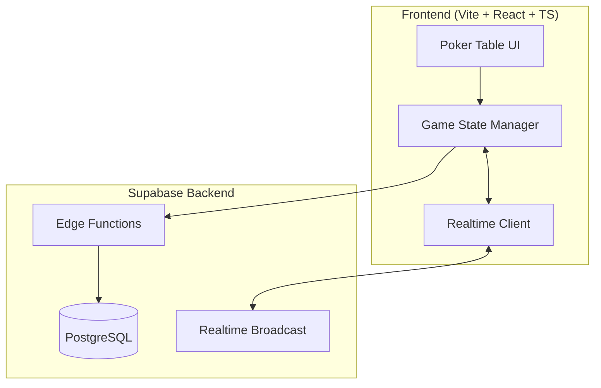
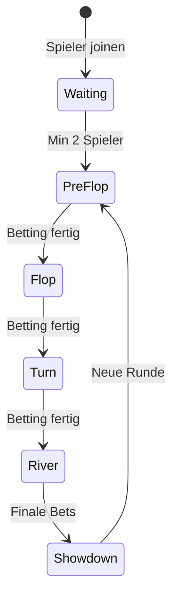

# Texas Hold'em Poker - Implementierungsplan

Echtzeit Texas Hold'em Poker mit TypeScript Frontend und Supabase Backend.

---

## Architektur

---

## Datenbank-Schema

### players
| Spalte | Typ | Beschreibung |
|--------|-----|--------------|
| id | uuid | Primary Key |
| name | text | Spielername |
| chips | integer | Aktuelle Chips (Start: 1000) |
| seat_position | integer | Platz 0-8 |
| is_active | boolean | Noch im Spiel? |

### game_state
| Spalte | Typ | Beschreibung |
|--------|-----|--------------|
| id | uuid | Primary Key |
| phase | text | 'waiting', 'preflop', 'flop', 'turn', 'river', 'showdown' |
| community_cards | jsonb | Community Cards Array |
| pot | integer | Aktueller Pot |
| current_bet | integer | Aktueller Einsatz |
| dealer_position | integer | Dealer Button Position |
| current_player | uuid | Wer ist dran? |

### player_hands
| Spalte | Typ | Beschreibung |
|--------|-----|--------------|
| id | uuid | Primary Key |
| player_id | uuid | FK zu players |
| cards | jsonb | 2 Hole Cards |
| current_bet | integer | Einsatz dieser Runde |
| has_folded | boolean | Gefoldet? |

---

## Spielablauf

---

## Features

- ✅ Echtzeit-Synchronisation via Supabase Realtime
- ✅ 6-9 Spieler pro Tisch
- ✅ Visuell aufwändiges UI (Animationen, 3D-Karten)
- ✅ Sound-Effekte (Karten, Chips)
- ✅ Spielgeld (Start: 1000 Chips)
